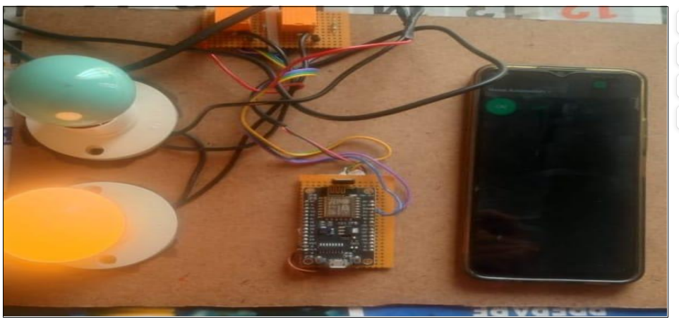

# 🌐💡 IoT Based Switchboard

## 📄 Project Overview
This project is an IoT-based smart switchboard system using the ESP8266 module. It allows users to control electrical appliances through a web application as well as manually. The system provides real-time switching, remote control ability, and supports home automation.

---

## 🏗️ Block Diagram  

---

## 📘 Project Report  
📄 **Full Report PDF:**  
[IOT BASED SWITCHBOARD.pdf](IOT%20BASED%20SWITCHBOARD.pdf)

---

## ⚙️ ESP8266 Code  
🔌 **Firmware Code:**  
[code.ESP8266](code.ESP8266)

---

## 💻 Web Application Files  
🌐 **Web App Code Folder:**  
[code for web application](code%20for%20web%20application)

---

## 📝 Features
- Remote ON/OFF control  
- Manual switch support  
- Web dashboard interface  
- Real-time appliance control  
- Low power consumption  

---

## 📦 Folder Contents
- `image.png` → Block diagram  
- `IOT BASED SWITCHBOARD.pdf` → Full project report  
- `code.ESP8266` → NodeMCU firmware  
- `code for web application` → Front-end files (HTML/CSS/JS)  

---

## 🚀 Usage
1. Upload the ESP8266 code into NodeMCU.  
2. Place web application files in your hosting folder.  
3. Connect relays and appliances.  
4. Access the web UI to control the switchboard.  

---
